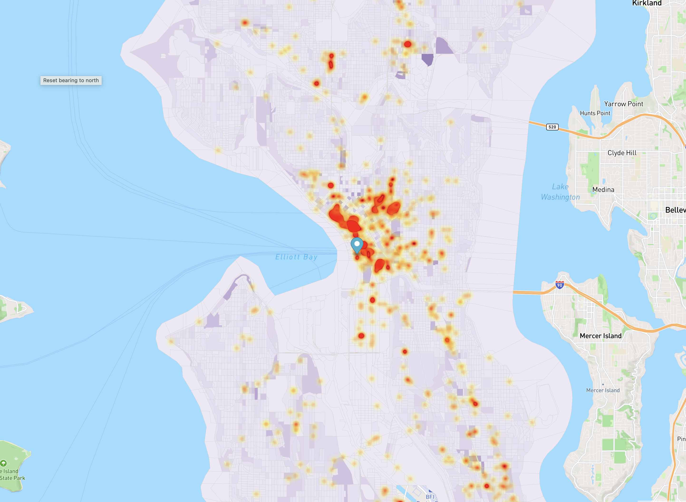
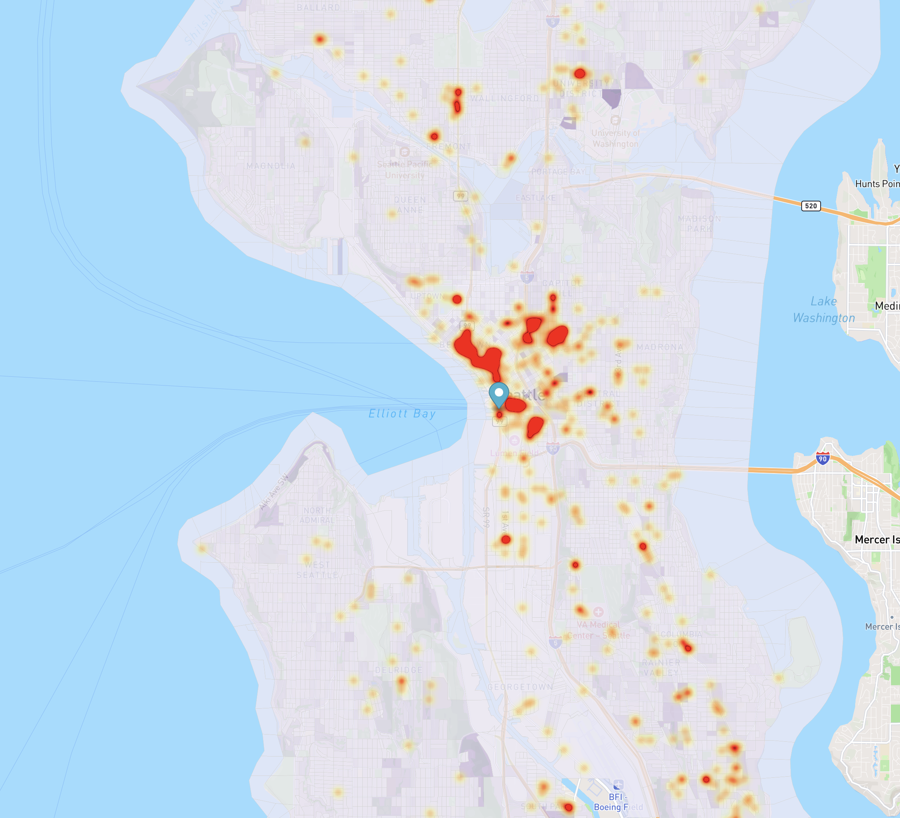
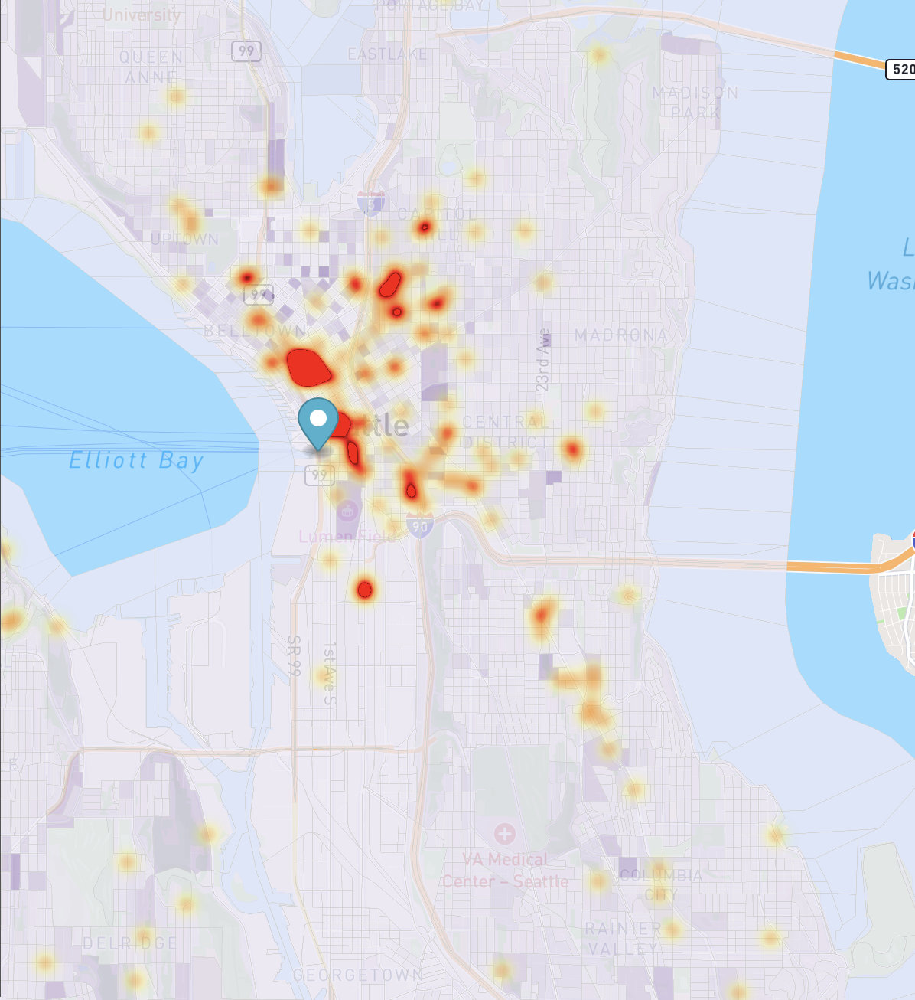

# Gun Crime in Seattle

Gun crime in highly populated areas in important to study in order to ensure the safety of many. **Seattle** is a largely populated city in *Washington State* and the gun crime trends in this area can help policy makers understand the impacts their policies have on the safety of society. Looking at how gun crime changed throughout time and correlating the amount with the gun policies placed recent to that year can help explain what gun policies were effective. 

## Seattle Gun Crime in 2010

Prior to **2010** many gun laws were established that impacted the gun use that year.
For example, the Protection of Lawful Commerce in Arms Act was signed by President George Bush to prevent gun manufacturers from being named in federal or state suits, as well as the National Instant Criminal Background Check Improvement Act was signed that required background checks for gun-buyers and prohibitted the mentallly ill from purchasing firearms. After George Bushes term, President Barack Obama signed a federal law that allowed gun owners to bring firearms into national parks (Gray, S 2018).

## Seattle Gun Crime in 2015

From 2010 to **2015** many events occurred.
For example, the tragic Sandy Hook school shooting occured creating great fear in society about gun usage, the Indetectable Firearms Act of 1988 that required all guns have enough metal to be detected was extended until 2035, and a specific procedure was mandated for background checks for gun sales to avoid loopholes (Longley, 2023).

## Seattle Gun Crime in 2023

From 2015 to **2023** many events occured including, the banning of assault style weapons with high-yield magazines, Donald Trump served his term and supported the banning of sales on "bump fire stocks" that make semi-automatic weapons automatic, and Judge Robert Lasnik in Seattle issued a temporary ban on untraceable and undetectable plastic gun blueprints (Longley, 2023).

## See also
- [Resource 1](https://kingcounty.gov/en/dept/pao/about-king-county/about-pao/data-reports/gun-violence-data)
- [Resource 2](https://www.seattletimes.com/seattle-news/seattle-seems-to-be-accepting-a-new-normal-of-higher-gun-violence/)
- [Resource 3](https://gunresponsibility.org/wp-content/uploads/2021/12/GV-Fact-Sheet.pdf)

## References
1. "Gray, S. (2019, April 30). A timeline of gun control laws in the U.S. Time. https://time.com/5169210/us-gun-control-laws-history-timeline/"
2. "Longley, R. (2023, January 8). See a timeline of gun control in the U.S. from 1791 to the present. ThoughtCo. https://www.thoughtco.com/us-gun-control-timeline-3963620"